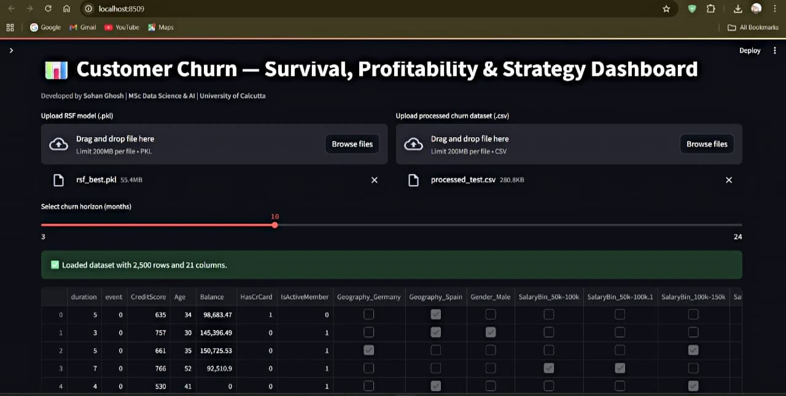

# Customer Churn — Survival, Profitability & Strategy Dashboard

**Developed by Sohan Ghosh**  
*M.Sc. in Data Science & Artificial Intelligence, University of Calcutta*

---

## Overview

This project presents a comprehensive analytical system to predict **when** a customer will churn, **why** they are likely to leave, and **how much** their retention is worth financially.  
It combines **statistical survival analysis**, **machine learning**, and **profitability modeling** to enable data-driven retention strategy decisions.

---

## Core Components

- **Survival Analysis (Kaplan–Meier, Cox PH)** — Understands customer lifetime patterns.  
- **Machine Learning (Random Survival Forests)** — Predicts churn timing and probability.  
- **Business Simulation (Net Present Value modeling)** — Quantifies financial impact of retention offers.  
- **Interactive Streamlit Dashboard** — Visualizes churn risk, survival curves, and profitability insights in real time.

**Goal:** Help organizations interpret churn risk, prioritize high-value customers, and evaluate retention offers with measurable ROI.

---

## Key Features

- Random Survival Forest (RSF) modeling for time-to-churn prediction  
- Kaplan–Meier and Cox PH survival curves for interpretability  
- Net Present Value (NPV) simulation linking churn risk to business value  
- Feature importance analysis with automatic interpretation  
- Interactive Streamlit dashboard for live parameter tuning and visualization  
- Automated export of PDF and CSV reports  
- RSF achieves a **C-index of 0.81** on test data

---

## Project Workflow

### Phase 1 — Data Understanding & Preprocessing
- Cleaned missing data and standardized categorical encodings  
- Derived `duration` (customer tenure) and `event` (churn indicator) variables  
- Created quantile-based bins for salary and credit score  
- One-hot encoded categorical variables for modeling

### Phase 2 — Exploratory Data Analysis
- Examined churn behavior across demographics and product usage patterns  
- Identified key churn indicators such as inactive status, low salary, and low credit score

### Phase 3 — Survival Modeling
- **Kaplan–Meier Analysis:** Estimated survival probability over time (e.g., S(12) = 0.78 → 22% churn in one year)  
- **Cox PH Model:** Quantified hazard ratios; confirmed inactivity and low salary as major churn drivers

### Phase 4 — Random Survival Forest (RSF) Modeling
- Implemented RSF using `scikit-survival` with hyperparameter tuning  
- Model performance:
  - Training C-index: 0.83  
  - Testing C-index: 0.81  

### Phase 5 — Profitability Targeting
- Converted churn probabilities into monetary outcomes using NPV modeling  
- Formula:  
INV = (p_churn_H - p_churn_H * (1 - uplift)) × (Revenue × 12) - OfferCost

yaml
Copy code
- Customers with **INV > 0** are identified as profitable to retain

### Phase 6 — Model Explainability

| Feature | Importance | Interpretation |
|----------|-------------|----------------|
| IsActiveMember | 0.23 | Inactive customers are more likely to churn |
| CreditScore | 0.18 | Lower scores indicate higher churn risk |
| Salary_Q1 | 0.14 | Low income increases churn likelihood |
| Geography_Germany | 0.11 | Geographic differences in churn behavior |

### Phase 7 — Dashboard and Reporting
- **Inputs:** `rsf_best.pkl` (trained RSF model) and `processed_test.csv` (test dataset)  
- **Outputs:** Predicted churn probabilities, profitability metrics, feature importance plots, and downloadable reports

---

## Dashboard Preview

### Home Page

### Profitability Simulation

### Full Analytics Dashboard

---

## Results Summary

| Metric | Value |
|--------|-------|
| Training C-index | 0.83 |
| Testing C-index | 0.81 |
| Mean p(churn, 12 months) | 0.41 |
| Mean Incremental Value (INV) | ₹57.8 |
| High-Value Segment ROI | 3.2× higher expected INV |

### Key Insights
- Churn rates peak within the first 10 months  
- Inactive and low-salary customers are the highest-risk segments  
- RSF model ranks churn likelihood with strong predictive power  
- Targeting profitable customers yields approximately ₹57,000 incremental value annually  

---

## Tech Stack

| Category | Tools |
|-----------|--------|
| Language | Python 3.12 |
| Libraries | pandas, numpy, seaborn, matplotlib |
| Survival Modeling | lifelines, scikit-survival |
| Machine Learning | Random Survival Forest |
| Application Framework | Streamlit |
| Reporting | ReportLab |
| Environment | VS Code / Jupyter |
| Version Control | Git & GitHub |

---

## Setup Instructions

Follow the steps below to set up and run the project locally.

---

### Step 1: Clone the Repository
Clone this repository to your local machine:

git clone https://github.com/yourusername/customer-churn-survival-dashboard.git
cd customer-churn-survival-dashboard

yaml
Copy code

---

### Step 2: Install Dependencies
Install all required Python libraries:

pip install -r requirements.txt

yaml
Copy code

**Tip:** Use a virtual environment to maintain clean dependencies.

---

### Step 3: Run the Streamlit Application
Launch the Streamlit dashboard:

streamlit run streamlit_app.py

arduino
Copy code

Once the app starts, it will open in your default browser at:

http://localhost:8501/

yaml
Copy code

---

### Step 4: Upload the Required Files
Within the Streamlit interface, upload the following files when prompted:

| File | Description |
|------|--------------|
| `models/rsf_best.pkl` | Trained Random Survival Forest model |
| `processed_test.csv` | Preprocessed test dataset for predictions |

After uploading, the dashboard will automatically:

- Compute churn probabilities (`p_churn_H`)
- Calculate incremental profitability metrics (INV)
- Display feature importance and survival curves
- Allow downloads of PDF and CSV reports

---

### Step 5: View and Export Outputs
Once the analysis is complete, you can download the generated results directly from the dashboard:

| Output File | Description |
|--------------|-------------|
| `Churn_Survival_Report.pdf` | Two-page analytical summary with model and profitability metrics |
| `target_list_RSF_NPV.csv` | List of profitable customers with positive incremental value |

---

### Step 6: Stop the Application
To stop the app, return to your terminal and press:

CTRL + C

yaml
Copy code

---

### Optional: Virtual Environment Setup
If you wish to maintain a clean environment for the project, create and activate a virtual environment:

python -m venv venv
source venv/bin/activate # On Windows: venv\Scripts\activate
pip install -r requirements.txt

yaml
Copy code

---

## Example Business Insight

Offering ₹200 retention incentives to customers with more than 40% churn probability can retain approximately 25% of them, resulting in an incremental profit of ₹57,000 over 12 months.

---

## Conclusion

This project demonstrates a full **data-to-decision pipeline** integrating:

- Exploratory data analysis  
- Survival and machine learning modeling  
- Financial optimization  
- Interactive deployment via Streamlit  

It bridges statistical modeling with actionable business intelligence to support customer retention and profitability maximization.

---

## Author

**Sohan Ghosh**  
*M.Sc. in Data Science & Artificial Intelligence*  
Ramakrishna Mission Residential College, University of Calcutta  

Email: [sohan562001@gmail.com](mailto:sohan562001@gmail.com)  

---

## Acknowledgements

- Economic Research Unit, Indian Statistical Institute, Kolkata  
- Faculty of Data Science, University of Calcutta  
- OpenAI, Streamlit, and Scikit-Survival communities  

---

## PDF Report
An example of the generated report is available here:  
[Churn_Survival_Report.pdf](./Churn_Survival_Report.pdf)

Churn_Survival_Report.pdf
